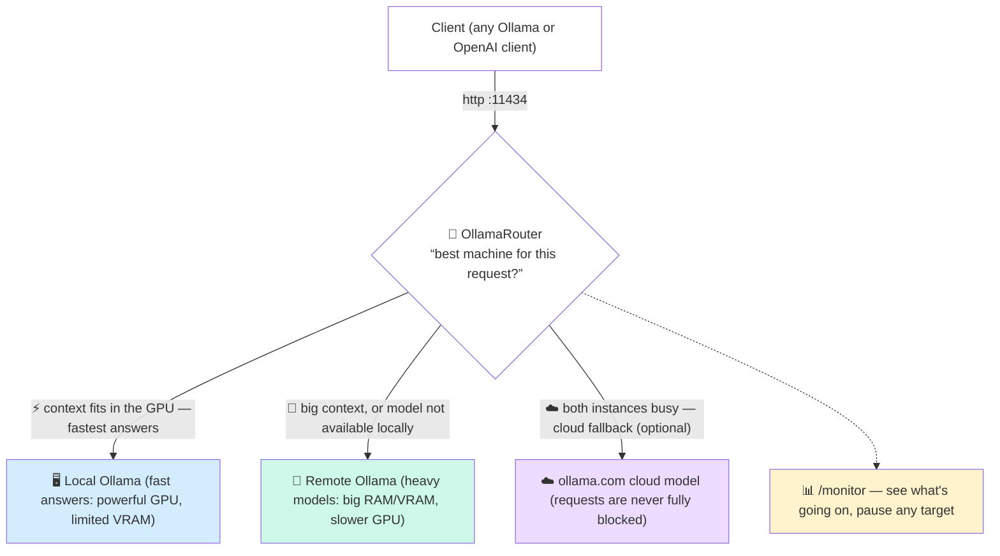
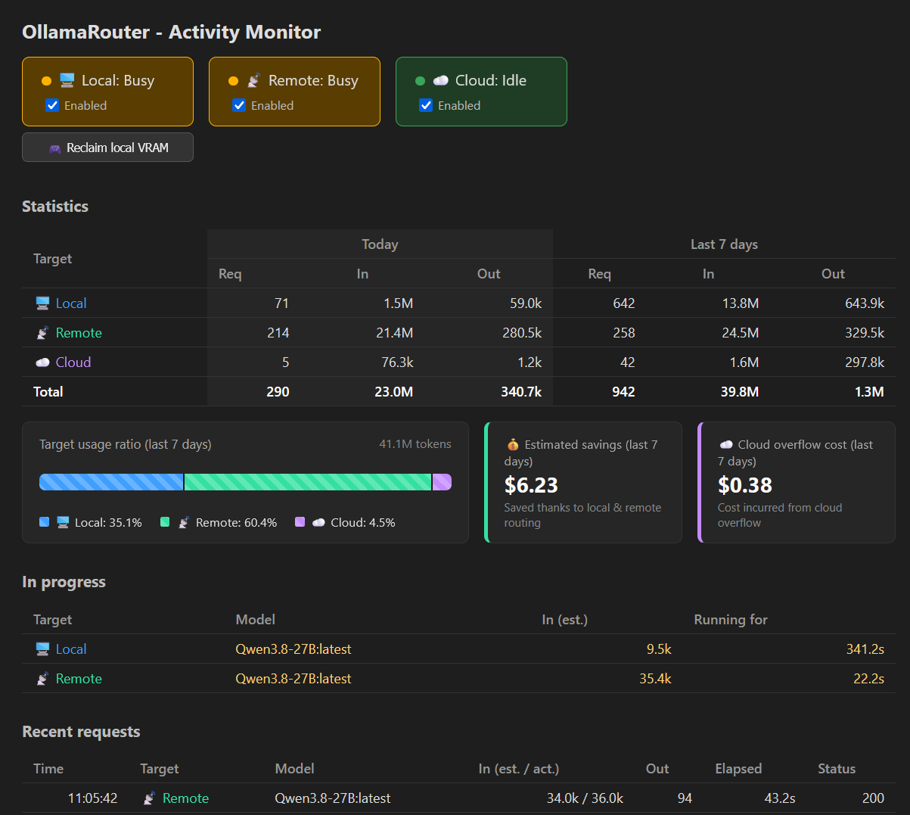

# OllamaRouter

OllamaRouter is a lightweight reverse proxy that sits in front of two [Ollama](https://ollama.com) instances and transparently routes each request to the most appropriate one:

- A **local** Ollama instance, running on a machine with a powerful GPU but **limited VRAM** (assumed to be a nVidia card).
- A **remote** Ollama instance (e.g. a server), with a lot of **unified RAM or VRAM** but a **less powerful GPU**.

The goal is to get the best of both worlds: use the fast local GPU whenever the request can fit in its available VRAM, and fall back to the remote server for everything else (larger contexts, models that don't fit locally, etc.).

OllamaRouter is more than a simple two-tier proxy, it also provides:

- **Cloud overflow** (optional, per model). When both instances are busy, requests can **overflow to [ollama.com cloud](https://ollama.com)** models, so a slow/unavailable Local or Remote instance never fully blocks incoming requests. See [Cloud overflow](#cloud-overflow).
- **Target failover on consecutive errors**. When client retries repeatedly fail on a target (e.g. context limit HTTP 400 or timeouts), requests automatically switch to the next target in the chain. See [Target failover on consecutive errors](#target-failover-on-consecutive-errors).
- **A built-in monitoring page**. A lightweight, dependency-free page at `/monitor` shows which targets are busy, which requests are in progress and what has been processed recently, and lets you enable/disable the **Local**, **Remote** and **Cloud** targets at runtime — switching the router between operating modes without restarting it. See [Monitoring](#monitoring).

## How it works

From the user's point of view, there is a single endpoint: the router listens on the standard Ollama port (`http://localhost:11434`) and transparently forwards each request to the local or the remote instance — or, optionally, to an [ollama.com cloud](https://ollama.com) model — depending on the model requested and the size of the prompt (a monitoring page is also available under `/monitor`, see [Monitoring](#monitoring)).



For every incoming request, OllamaRouter decides between `Local`, `Remote` and `Cloud` and forwards the request accordingly using [YARP](https://github.com/microsoft/reverse-proxy) (`Cloud` is physically routed to the **Local** instance, see [Cloud overflow](#cloud-overflow) below).

### Endpoints that are inspected and routed dynamically

Requests to the following endpoints are inspected to extract the prompt and the model name:

- `POST /api/chat`
- `POST /api/generate`
- `POST /v1/chat/completions`
- `POST /v1/completions`

For these requests, the routing decision is orchestrated by `RoutingDecisionService` using a priority-ordered chain of target handlers (`IRoutingTargetHandler`: **Local** → **Remote** → **Cloud**):

1. **Available target dispatch:** The router evaluates targets in order and dispatches the request to the first target that is **available** (enabled and not busy) and **capable** of handling it (`CanProcessAsync`):
   - **Local (`LocalRoutingTargetHandler`)**: Eligible if the model is configured under `OllamaRouter:Models`, exists in the local catalog, the estimated token count fits within `MaxLocalTokens`, and the model is either already loaded in memory (checked via `/api/ps`) or sufficient free GPU VRAM is available (checked via `nvidia-smi` against `MinRequiredVramMB`). If a model is only available locally, Local handles it exclusively.
   - **Remote (`RemoteRoutingTargetHandler`)**: Accepts requests for models that are available remotely (unconfigured models, models exceeding local token limits, or models that don't fit local VRAM naturally fall through to Remote).
   - **Cloud (`CloudRoutingTargetHandler`, overflow)**: Acts as an overflow target. If Local and Remote are unavailable or cannot handle the request, Cloud accepts it if enabled and a `CloudModel` is configured for the requested model (see [Cloud overflow](#cloud-overflow)).
2. **Busy fallback:** If all eligible targets are currently busy:
   - The router falls back to the first capable **enabled non-overflow target** (Local or Remote), allowing requests to queue behind a busy primary instance.
   - If no primary target can handle the request, it checks enabled overflow targets (Cloud).
   - If no enabled target is capable of handling the request, OllamaRouter rejects the request with HTTP `503 Service Unavailable`.

If the request body cannot be parsed for any reason, the request falls back to the default enabled instance (Remote if enabled, otherwise Local).

> **Note.** Each target (**Local**, **Remote**, **Cloud**) can also be disabled individually, at any time, from the [monitoring page](#monitoring). If a target is disabled, it will **never** handle any request. A **busy** target can still accept queued requests as a fallback when all eligible instances are in use, but a **disabled** target is completely excluded from routing. Disabling **Cloud** disables cloud overflow for all models. This lets you switch the router between operating modes (Local only, Remote only, Local + Cloud, Remote + Cloud, …) without restarting it.

### Cloud overflow

When a model's configuration includes a `CloudModel` entry (e.g. `deepseek-v3.1:671b-cloud` or `glm-4.6:cloud`), OllamaRouter can overflow to [ollama.com cloud](https://ollama.com) whenever using **Remote** would mean waiting behind an already-busy request:

- The request is still physically forwarded to the **Local** instance (same YARP cluster), because it is expected to be **signed in to ollama.com** (`ollama signin`) and therefore able to relay chat/generate requests to the cloud on its own.
- Before forwarding, the `model` field of the request body is rewritten to the configured `CloudModel` name, so the local Ollama process knows which cloud-hosted model to relay to.
- "Busy" is a simple, already-in-use signal: an instance is considered busy as soon as it currently has at least one chat/generate request in flight (see `IActivityMonitorService.IsBusy`).
- This is meant as a last resort for a model that has no directly usable ollama.com cloud equivalent (e.g. Qwen3.8 isn't offered as an ollama.com cloud model): configure a comparable/cheaper cloud model instead of leaving requests queued behind a busy Remote instance.
- Cloud overflow is entirely opt-in per model: leave `CloudModel` unset (the default) to keep the original Local/Remote-only behavior.

> **Note.** Unlike Local/Remote, OllamaRouter does not talk directly to ollama.com: it relies on the Local Ollama instance's own cloud relay and credentials. No API key or cloud URL needs to be configured in OllamaRouter itself.

### Target failover on consecutive errors

When errors or timeouts arise (such as HTTP 400 Bad Request because a prompt exceeds an instance's context size, or gateway timeouts), LLM clients typically retry the request repeatedly until success. If the chosen target cannot process the request, these retries can take an extremely long time.

To alleviate this, OllamaRouter correlates requests using only their **estimated prompt token count** and tracks consecutive failures across **adjacent requests**:

- If adjacent requests with the same estimated token count fail **3 times** on the same target (configurable via `MaxConsecutiveFailures`, defaulting to `3`), the router dynamically skips that target and routes subsequent retries to the next target in the chain (**Local** → **Remote** → **Cloud**).
- For example, if a large 91.3k-token request fails 3 times on **Remote** (e.g. returning 400 errors or timing out):
  ```
  02:36:08   📡 Remote   Qwen3.8-27B:latest   91.3k / -   -   307.3s   400
  02:42:08   📡 Remote   Qwen3.8-27B:latest   91.3k / -   -   358.1s   400
  02:43:59   📡 Remote   Qwen3.8-27B:latest   91.3k / -   -   332.4s   400
  ```
  The next 91.3k retry will be dispatched to **Cloud** if enabled. If Cloud is disabled or has no `CloudModel` configured, it keeps the Remote target as fallback.
- Similarly, if a request fails 3 times on **Local**, it fails over to **Remote**; if Remote also fails 3 times, it fails over to **Cloud**.
- Adjacency is strict: any request with a different token count breaks adjacency and resets tracking, and any successful response (`HTTP status < 400`) clears the failure count.

### Other endpoints

- All other requests (model pull/push/delete, etc.) are routed to **Local** by default.
- `GET /api/tags` and `GET /v1/models` return a **merged** list of models available on both instances (local models take priority in case of a name conflict).
- `GET /api/ps` returns a **merged** list of models currently loaded/running on both instances.
- Any other request is proxied as a catch-all to the instance selected by the routing decision.

## Setup Ollama instances

OllamaRouter expects both instances to expose the **same model names**, so that a request can be transparently routed to either one. The steps below set up a quantized model locally (to fit in limited VRAM) and a less-quantized (or full-precision) version of the same model remotely (to take advantage of the larger unified RAM/VRAM), both aliased under the same model name.

### Local Ollama

Set the following environment variables:
- `OLLAMA_HOST` to `127.0.0.1:11435`
- `OLLAMA_KV_CACHE_TYPE` to `q8_0`
- `OLLAMA_FLASH_ATTENTION` to `1`

Then install (or restart) Ollama for the changes to take effect.

Pull the model you want to use locally, e.g.:
```powershell
ollama pull jetelain/Qwen3.8-27B:iq3
```

Create an alias for this model, so it matches the name used on the remote instance (feel free to tune the parameters), e.g.:
```powershell
Invoke-RestMethod -Uri 'http://localhost:11435/api/create' -Method Post -ContentType 'application/json' -Body '{
  "model": "Qwen3.8-27B",
  "from": "jetelain/Qwen3.8-27B:iq3",
  "parameters": {
    "num_ctx": 49152
  }
}'
```

> With `num_ctx` set to `49152`, the corresponding `Models:Qwen3.8-27B:MaxLocalTokens` setting should be around `36864` (75% of `num_ctx`, see [Configuration](#configuration)).

### Remote Ollama

See [this guide](https://github.com/jetelain/wiki/blob/main/ai/server.md) for a more comprehensive walkthrough of setting up a remote Ollama instance.

Set the following environment variable:
- `OLLAMA_HOST` to `0.0.0.0:11434`

Then install (or restart) Ollama for the change to take effect.

Pull the model you want to use, e.g.:
```bash
ollama pull jetelain/Qwen3.8-27B:latest
```

Create an alias for this model using the exact same name as on the local instance (feel free to tune the parameters), e.g.:
```bash
curl http://localhost:11434/api/create -d '{
  "model": "Qwen3.8-27B",
  "from": "jetelain/Qwen3.8-27B",
  "parameters": {
    "num_ctx": 196608
  }
}'
```

> The remote instance's larger `num_ctx` (`196608`) is only reached once the request no longer fits locally, so it does not need to follow the same 75% rule: the remote instance has no comparable `MaxLocalTokens` cap.

## Configuration

Configuration is provided through the `OllamaRouter` section of `appsettings.json` (or any other standard .NET configuration source, such as environment variables):

```json
{
  "OllamaRouter": {
	"Models": {
	  "Qwen3.8-27B": {
		  "MaxLocalTokens": 36864,
		  "MinRequiredVramMB": 13500,
		  "CloudModel": "deepseek-v3.1:671b-cloud"
		},
	  "llama3": {
		"MaxLocalTokens": 24576,
		"MinRequiredVramMB": 4096
	  }
	},
	"LocalUrl": "http://127.0.0.1:11435",
	"RemoteUrl": "http://aiserver.local:11434"
	}
}
```

> **Note on model names.** Configuration keys **must not include the tag suffix** (`:latest`, `:8b`, …): the .NET configuration binder treats `:` as a path separator, so a key such as `"Qwen3.8-27B:latest"` does not bind to the dictionary. Clients also frequently send the implicit `:latest` tag even when the model is stored without one, so the router strips the tag part before looking up the configuration (see `RoutingDecisionService.NormalizeModelName`). Use a single entry per base model name; all tag variants will share the same thresholds.

| Setting            | Description                                                                                     |
|--------------------|---------------------------------------------------------------------------------------------------|
| `Models`           | Dictionary of model names (base name, no tag) to their routing thresholds. **Any model not listed here is always routed to the remote instance.**                          |
| `Models:*:MaxLocalTokens`   | Maximum estimated token count that the local instance is allowed to handle for this model. Keep margin to leave room for model output, 75% of the local model's configured `num_ctx` should be fine. |
| `Models:*:MinRequiredVramMB`| Minimum amount of free VRAM (in MB) required on the local GPU to route a request for this model there. It should match VRAM usage of the model with a little margin.           |
| `Models:*:CloudModel`| Optional name of the equivalent model hosted on [ollama.com cloud](https://ollama.com) (e.g. `glm-5.3-flash:cloud`). When set, enables overflow to **Cloud** for this model whenever Remote is busy (see [Cloud overflow](#cloud-overflow)). Leave unset to disable cloud overflow for this model. |
| `LocalUrl`         | Base URL of the local Ollama instance.                                                            |
| `RemoteUrl`        | Base URL of the remote Ollama instance.                                                           |
| `BindAddress`      | Address the router itself listens on. Defaults to `http://localhost:11434`. Set it to e.g. `http://0.0.0.0:11434` to accept connections from other machines. |
| `TokenEstimator`   | Token estimation strategy: `"Heuristic"` (default, fast, zero heap memory overhead, saves ~24 MB RAM by omitting the BPE dictionary) or `"Tiktoken"` (uses Microsoft.ML.Tokenizers `cl100k_base`). |
| `TokenEstimationOverheadFactor` | Multiplicative correction applied to the estimated token count, to compensate for the systematic underestimation of the generic tokenizer versus the actual tokenizer and chat template of targeted models. Defaults to `1.0` (no correction); see [recommendations below](#token-estimation-overhead-recommendations). |
| `MaxConsecutiveFailures` | Number of consecutive failures on a target for adjacent requests with the same estimated token count before switching to the next target in the chain (`Local` → `Remote` → `Cloud`). Defaults to `3`. Set to `0` to disable automatic target switching. |
| `Pricing:PromptPricePerMillion` | Optional price per 1,000,000 prompt / input tokens. Used to calculate 7-day estimated savings and cloud overflow cost. Alias: `InputPricePerMillion`. |
| `Pricing:CompletionPricePerMillion` | Optional price per 1,000,000 completion / output tokens. Used to calculate 7-day estimated savings and cloud overflow cost. Alias: `OutputPricePerMillion`. |
| `Pricing:PricePerMillion` | Optional flat price per 1,000,000 tokens when prompt and completion rates are not differentiated. |
| `Pricing:Currency` | Currency symbol or label to display in the monitoring UI (e.g. `$`, `€`, `USD`). Defaults to `$`. |

### Token estimation overhead recommendations

OllamaRouter estimates prompt token count prior to routing so it can check against `MaxLocalTokens` without having to download full tokenizer files for every model. Because generic tokenizers (`Tiktoken` or `Heuristic`) differ from the exact vocabulary and chat templates used by targeted models, set `TokenEstimationOverheadFactor` according to your primary model family:

| Model Family | Vocabulary Size | Recommended (`Tiktoken`) | Recommended (`Heuristic`) | Notes |
| :--- | :---: | :---: | :---: | :--- |
| **Qwen 3.8** (e.g. `Qwen3.8-27B`) | 248k | **1.09** | **1.11** | Qwen 3.8 expands token embeddings to 248,320. 1.09 is empirically validated for high-context workloads. |

> **Tip.** The monitoring page (`/monitor`) dynamically measures the ratio between raw estimated tokens and Ollama's actual reported prompt tokens for every completed request, providing you with a tailored recommendation for your exact models and prompts.
>
> If your prompts are predominantly non-English (e.g. French, German, Chinese) or contain heavy code indentation, add an extra `+0.05` margin to the overhead factor to prevent unexpected overflows.

## Installation

### Manual (Windows)

Download the latest [`OllamaRouter-win-x64.zip`](../../releases) from the [releases page](../../releases), extract it into a folder of your choice and run `OllamaRouter.exe`. The executable is self-contained: no .NET installation is required.

### From source

```powershell
dotnet run --project OllamaRouter\OllamaRouter.csproj
```

## Running

After installation, start the router by launching `OllamaRouter.exe`, or from source:

```powershell
dotnet run --project OllamaRouter\OllamaRouter.csproj
```

By default, the router listens on `http://localhost:11434`, the standard Ollama port, so it can be used as a drop-in replacement for a direct Ollama endpoint in your existing tools and clients. On startup, a link to the [monitoring UI](#monitoring) is printed to the console.

## Monitoring

OllamaRouter exposes a very lightweight, dependency-free monitoring page at `/monitor` (e.g. `http://localhost:11434/monitor`), backed by a JSON endpoint at `/monitor/api`. 

The page shows:

- Whether each instance (**Local**/**Remote**, and **Cloud** when at least one model has a `CloudModel` configured, see [Cloud overflow](#cloud-overflow)) is currently **busy** processing a chat/generate request.
- An **Enabled** checkbox per instance, to enable/disable each target at runtime. Toggling it immediately changes the routing behavior: a disabled target is completely excluded from routing and will never receive requests (unlike a busy target, which can still queue requests if all eligible targets are busy). The new state is persisted to a dedicated JSON file (`%LOCALAPPDATA%\OllamaRouter\targets.json` on Windows), so it is restored on the next startup. The state file is written on a best-effort ("failsafe") basis: if it cannot be written, the change still takes effect in memory and a warning is logged — `appsettings.json` is never modified at runtime.
- The requests currently **in progress**, with target instance, model, estimated input tokens and running time.
- A history of the most recent completed requests (last 50), with model, estimated vs. actual input tokens, actual output tokens, elapsed time and HTTP status. Failed requests are highlighted.
- Aggregated **token statistics** per target (and overall total): number of requests, actual input tokens and actual output tokens, both for the **current day** and for the **last 7 days**. Only successful requests with actual token counts are counted. These statistics are persisted to a dedicated JSON file (`%LOCALAPPDATA%\OllamaRouter\activity-statistics.json` on Windows) so they survive restarts, and are written on a best-effort basis (throttled to at most one write per 30 seconds, on day rollover, and on application shutdown).
- A **target usage ratio progress bar** visually breaking down the share of tokens processed by each target (**Local**, **Remote**, and **Cloud**) over the **last 7 days**.
- **Estimated savings and cloud overflow cost** based on the **last 7 days**, displayed whenever `Pricing` is configured in the settings. It calculates the money saved by serving requests locally and remotely instead of paying cloud API rates, as well as the cost incurred from cloud overflow. If pricing is not configured, this section is completely hidden.
- A **live token estimation overhead recommendation** card at the bottom of the page, computed from recent requests by comparing raw estimator token counts against the actual prompt tokens reported by Ollama. It displays the overall observed factor, per-model factors, and the exact recommended value to put in `appsettings.json`.

The page auto-refreshes every 2 seconds by polling `/monitor/api`. A clickable link to this page is printed to the console when the router starts (see [Running](#running)).



## Requirements

- .NET 8 SDK
- Two reachable Ollama instances (local and remote)
- `nvidia-smi` available on the local machine to report free VRAM (returns 0 if not available, which effectively disables local routing based on VRAM)

## Project structure

- `Middleware/OllamaRoutingMiddleware.cs` – inspects intercepted requests and sets the `X-Ollama-Target` header used by YARP for routing.
- `Services/RoutingDecisionService.cs` – orchestrates the chain of target handlers to make the routing decision (first available capable target, with queued fallback when busy).
- `Services/IRoutingTargetHandler.cs` – abstraction for routing destinations (`Local`, `Remote`, `Cloud`) defining availability, overflow status, and request capability.
- `Services/LocalRoutingTargetHandler.cs` – target handler for the local Ollama instance (model configuration, token limits, loaded models, GPU VRAM).
- `Services/RemoteRoutingTargetHandler.cs` – target handler for the remote server.
- `Services/CloudRoutingTargetHandler.cs` – overflow target handler relaying to ollama.com cloud models when primary instances are busy.
- `Services/RoutingContext.cs` – encapsulates request parameters, token estimates, thresholds, and shared catalog checks for a routing decision.
- `Services/OllamaModelCatalogClient.cs` – fetches and merges model catalogs (`/api/tags`, `/v1/models`, `/api/ps`) from both instances.
- `Parsing/OllamaRequestParser.cs` – extracts the prompt and model name from request bodies.
- `ReverseProxy/OllamaReverseProxyConfig.cs` – builds the YARP routes/clusters in code.
- `Endpoints/OllamaEndpointsExtensions.cs` – hybrid endpoints (`/api/tags`, `/api/ps`, `/v1/models`) that short-circuit YARP to return merged results.
- `Endpoints/MonitorEndpointsExtensions.cs` – lightweight monitoring UI (`/monitor`, `/monitor/api`) and target toggles (`POST /targets`).
- `Services/ActivityMonitorService.cs` – in-memory bookkeeping of busy state, in-progress requests and recent request history used by the monitoring UI.
- `Services/ActivityStatisticsService.cs` – per-target counters (requests, actual input/output tokens) with current-day and last-7-days aggregation, persisted on a best-effort basis to a dedicated JSON file in the application data folder (`%LOCALAPPDATA%\OllamaRouter\activity-statistics.json` on Windows) and exposed via `/monitor/api`.
- `Services/TargetAvailabilityService.cs` – in-memory state of the Local/Remote/Cloud enable/disable flags, loaded at startup from and persisted on a best-effort basis to a dedicated JSON state file in the application data folder (`%LOCALAPPDATA%\OllamaRouter\targets.json` on Windows), toggled via `POST /targets`.

## Tests

Unit tests are located in `OllamaRouter.Tests` and cover the request parser, the routing decision policy, the model catalog merge logic, the middleware, and the YARP configuration.

```powershell
dotnet test
```

### End-to-end tests

`OllamaRouter.E2ETests` is a standalone console executable that exercises a **running** OllamaRouter instance (and its underlying local/remote Ollama instances) through both the native Ollama API (using [OllamaSharp](https://github.com/awaescher/OllamaSharp)) and the OpenAI-compatible API (using `Microsoft.Extensions.AI.OpenAI`). It is not a substitute for the unit tests above: it performs real HTTP calls against a live deployment and is meant to be run manually, or as a smoke test after deployment/configuration changes.

It checks that:
- `GET /api/tags` returns a non-empty merged list of models (native Ollama API).
- `GET /api/ps` returns a valid response (native Ollama API).
- `POST /api/chat` returns a completion (native Ollama API).
- `GET /v1/models` returns a non-empty merged list of models (OpenAI-compatible API).
- `POST /v1/chat/completions` returns a completion (OpenAI-compatible API).

Before running it, make sure OllamaRouter is running (see [Running](#running)) and that both the local and remote Ollama instances are up and have the expected model pulled and aliased (see [Setup Ollama instances](#setup-ollama-instances)).

```powershell
dotnet run --project OllamaRouter.E2ETests\OllamaRouter.E2ETests.csproj
```

The executable prints a `PASS`/`FAIL` line per scenario and exits with a non-zero code if any scenario fails, so it can be wired into a CI pipeline or a post-deployment check. It can be configured through the following environment variables:

| Variable                   | Description                                                        | Default                   |
|----------------------------|----------------------------------------------------------------------|----------------------------|
| `OLLAMAROUTER_E2E_URL`     | Base URL of the OllamaRouter instance under test.                    | `http://localhost:11434`  |
| `OLLAMAROUTER_E2E_MODEL`   | Name of the model aliased on both the local and remote instances.    | `Qwen3.8-27B:latest`      |

## License

OllamaRouter is released under the [MIT License](LICENSE).

> **Disclaimer.** OllamaRouter is an independent, open-source project and is **not affiliated with, endorsed by, or associated with Ollama Inc.** in any way. "Ollama" and the related trademarks are the property of Ollama Inc.
