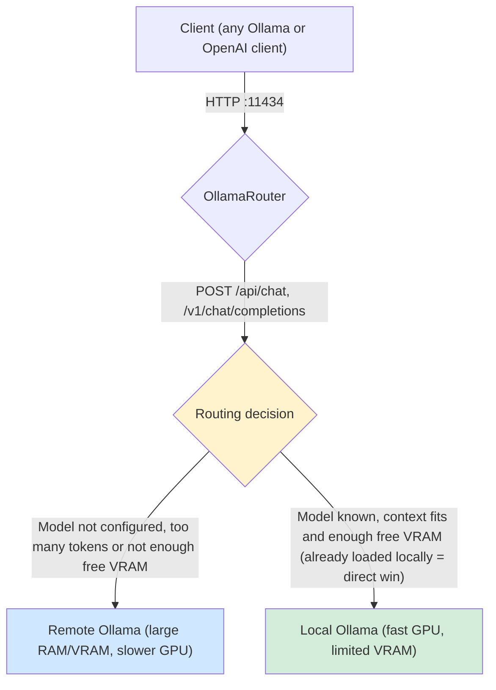

# OllamaRouter

OllamaRouter is a lightweight reverse proxy that sits in front of two [Ollama](https://ollama.com) instances and transparently routes each request to the most appropriate one:

- A **local** Ollama instance, running on a machine with a powerful GPU but **limited VRAM** (assumed to be a nVidia card).
- A **remote** Ollama instance (e.g. a server), with a lot of **unified RAM or VRAM** but a **less powerful GPU**.

The goal is to get the best of both worlds: use the fast local GPU whenever the request can fit in its available VRAM, and fall back to the remote server for everything else (larger contexts, models that don't fit locally, etc.).

## How it works

From the user's point of view, there is a single endpoint: the router listens on the standard Ollama port (`http://localhost:11434`) and transparently forwards each request to either the local or the remote instance, depending on the model requested and the size of the prompt.



For every incoming request, OllamaRouter decides between `Local` and `Remote` and forwards the request accordingly using [YARP](https://github.com/microsoft/reverse-proxy).

### Endpoints that are inspected and routed dynamically

Requests to the following endpoints are inspected to extract the prompt and the model name:

- `POST /api/chat`
- `POST /api/generate`
- `POST /v1/chat/completions`
- `POST /v1/completions`

For these requests, the routing decision is made as follows:

1. Only models explicitly configured under `OllamaRouter:Models` are eligible for local routing. Any other model name is routed to **Remote** immediately.
2. The prompt is tokenized and the token count is estimated.
3. If the estimated token count exceeds the per-model `MaxLocalTokens`, the request is routed to **Remote** (the context wouldn't fit reliably on the local GPU).
4. Otherwise, if the requested model is already loaded on the **local** instance (checked via `/api/ps`), the request is routed to **Local** (no need to check VRAM, it's already loaded).
5. Otherwise, the free VRAM on the local GPU is checked (via `nvidia-smi`). If it is greater than or equal to the per-model `MinRequiredVramMB`, the request is routed to **Local**; otherwise it is routed to **Remote**.

If the request body cannot be parsed for any reason, the request is routed to **Remote** as a safe fallback.

### Other endpoints

- All other requests (model pull/push/delete, etc.) are routed to **Local** by default.
- `GET /api/tags` and `GET /v1/models` return a **merged** list of models available on both instances (local models take priority in case of a name conflict).
- `GET /api/ps` returns a **merged** list of models currently loaded/running on both instances.
- Any other request is proxied as a catch-all to the instance selected by the routing decision.

## Setup Ollama instances

OllamaRouter expects both instances to expose the **same model names**, so that a request can be transparently routed to either one. The steps below set up a quantized model locally (to fit in limited VRAM) and a less-quantized (or full-precision) version of the same model remotely (to take advantage of the larger unified RAM/VRAM), both aliased under the same model name.

### Local Ollama

Set the following environment variables:
- `OLLAMA_HOST` to `127.0.0.1:11435`
- `OLLAMA_KV_CACHE_TYPE` to `q8_0`
- `OLLAMA_FLASH_ATTENTION` to `1`

Then install (or restart) Ollama for the changes to take effect.

Pull the model you want to use locally, e.g.:
```powershell
ollama pull jetelain/Qwen3.8-27B:iq3
```

Create an alias for this model, so it matches the name used on the remote instance (feel free to tune the parameters), e.g.:
```powershell
Invoke-RestMethod -Uri 'http://localhost:11435/api/create' -Method Post -ContentType 'application/json' -Body '{
  "model": "Qwen3.8-27B",
  "from": "jetelain/Qwen3.8-27B:iq3",
  "parameters": {
    "num_ctx": 49152
  }
}'
```

### Remote Ollama

See [this guide](https://github.com/jetelain/wiki/blob/main/ai/server.md) for a more comprehensive walkthrough of setting up a remote Ollama instance.

Set the following environment variable:
- `OLLAMA_HOST` to `0.0.0.0:11434`

Then install (or restart) Ollama for the change to take effect.

Pull the model you want to use, e.g.:
```bash
ollama pull jetelain/Qwen3.8-27B:latest
```

Create an alias for this model using the exact same name as on the local instance (feel free to tune the parameters), e.g.:
```bash
curl http://localhost:11434/api/create -d '{
  "model": "Qwen3.8-27B",
  "from": "jetelain/Qwen3.8-27B",
  "parameters": {
    "num_ctx": 196608
  }
}'
```

## Configuration

Configuration is provided through the `OllamaRouter` section of `appsettings.json` (or any other standard .NET configuration source, such as environment variables):

```json
{
  "OllamaRouter": {
	"Models": {
	  "Qwen3.8-27B": {
		"MaxLocalTokens": 24500,
		"MinRequiredVramMB": 13500
	  },
	  "llama3": {
		"MaxLocalTokens": 30000,
		"MinRequiredVramMB": 4096
	  }
	},
	"LocalUrl": "http://127.0.0.1:11435",
	"RemoteUrl": "http://aiserver.local:11434"
  }
}
```

> **Note on model names.** Configuration keys **must not include the tag suffix** (`:latest`, `:8b`, …): the .NET configuration binder treats `:` as a path separator, so a key such as `"Qwen3.8-27B:latest"` does not bind to the dictionary. Clients also frequently send the implicit `:latest` tag even when the model is stored without one, so the router strips the tag part before looking up the configuration (see `RoutingDecisionService.NormalizeModelName`). Use a single entry per base model name; all tag variants will share the same thresholds.

| Setting            | Description                                                                                     |
|--------------------|---------------------------------------------------------------------------------------------------|
| `Models`           | Dictionary of model names (base name, no tag) to their routing thresholds. **Any model not listed here is always routed to the remote instance.**                          |
| `Models:*:MaxLocalTokens`   | Maximum estimated token count that the local instance is allowed to handle for this model. Keep margin to leave room for model output, half the size of model context should be used.                        |
| `Models:*:MinRequiredVramMB`| Minimum amount of free VRAM (in MB) required on the local GPU to route a request for this model there. It should match VRAM usage of the model with a little margin.           |
| `LocalUrl`         | Base URL of the local Ollama instance.                                                            |
| `RemoteUrl`        | Base URL of the remote Ollama instance.                                                           |

## Running

```powershell
dotnet run --project OllamaRouter\OllamaRouter.csproj
```

By default, the router listens on `http://localhost:11434`, the standard Ollama port, so it can be used as a drop-in replacement for a direct Ollama endpoint in your existing tools and clients.

## Requirements

- .NET 8 SDK
- Two reachable Ollama instances (local and remote)
- `nvidia-smi` available on the local machine to report free VRAM (returns 0 if not available, which effectively disables local routing based on VRAM)

## Project structure

- `Middleware/OllamaRoutingMiddleware.cs` – inspects intercepted requests and sets the `X-Ollama-Target` header used by YARP for routing.
- `Services/RoutingDecisionService.cs` – encapsulates the routing policy (token limit, model already loaded, free VRAM).
- `Services/OllamaModelCatalogClient.cs` – fetches and merges model catalogs (`/api/tags`, `/v1/models`, `/api/ps`) from both instances.
- `Parsing/OllamaRequestParser.cs` – extracts the prompt and model name from request bodies.
- `ReverseProxy/OllamaReverseProxyConfig.cs` – builds the YARP routes/clusters in code.
- `Endpoints/OllamaEndpointsExtensions.cs` – hybrid endpoints (`/api/tags`, `/api/ps`, `/v1/models`) that short-circuit YARP to return merged results.

## Tests

Unit tests are located in `OllamaRouter.Tests` and cover the request parser, the routing decision policy, the model catalog merge logic, the middleware, and the YARP configuration.

```powershell
dotnet test
```

### End-to-end tests

`OllamaRouter.E2ETests` is a standalone console executable that exercises a **running** OllamaRouter instance (and its underlying local/remote Ollama instances) through both the native Ollama API (using [OllamaSharp](https://github.com/awaescher/OllamaSharp)) and the OpenAI-compatible API (using `Microsoft.Extensions.AI.OpenAI`). It is not a substitute for the unit tests above: it performs real HTTP calls against a live deployment and is meant to be run manually, or as a smoke test after deployment/configuration changes.

It checks that:
- `GET /api/tags` returns a non-empty merged list of models (native Ollama API).
- `GET /api/ps` returns a valid response (native Ollama API).
- `POST /api/chat` returns a completion (native Ollama API).
- `GET /v1/models` returns a non-empty merged list of models (OpenAI-compatible API).
- `POST /v1/chat/completions` returns a completion (OpenAI-compatible API).

Before running it, make sure OllamaRouter is running (see [Running](#running)) and that both the local and remote Ollama instances are up and have the expected model pulled and aliased (see [Setup Ollama instances](#setup-ollama-instances)).

```powershell
dotnet run --project OllamaRouter.E2ETests\OllamaRouter.E2ETests.csproj
```

The executable prints a `PASS`/`FAIL` line per scenario and exits with a non-zero code if any scenario fails, so it can be wired into a CI pipeline or a post-deployment check. It can be configured through the following environment variables:

| Variable                   | Description                                                        | Default                   |
|----------------------------|----------------------------------------------------------------------|----------------------------|
| `OLLAMAROUTER_E2E_URL`     | Base URL of the OllamaRouter instance under test.                    | `http://localhost:11434`  |
| `OLLAMAROUTER_E2E_MODEL`   | Name of the model aliased on both the local and remote instances.    | `Qwen3.8-27B:latest`      |

## License

OllamaRouter is released under the [MIT License](LICENSE).

> **Disclaimer.** OllamaRouter is an independent, open-source project and is **not affiliated with, endorsed by, or associated with Ollama Inc.** in any way. "Ollama" and the related trademarks are the property of Ollama Inc.
